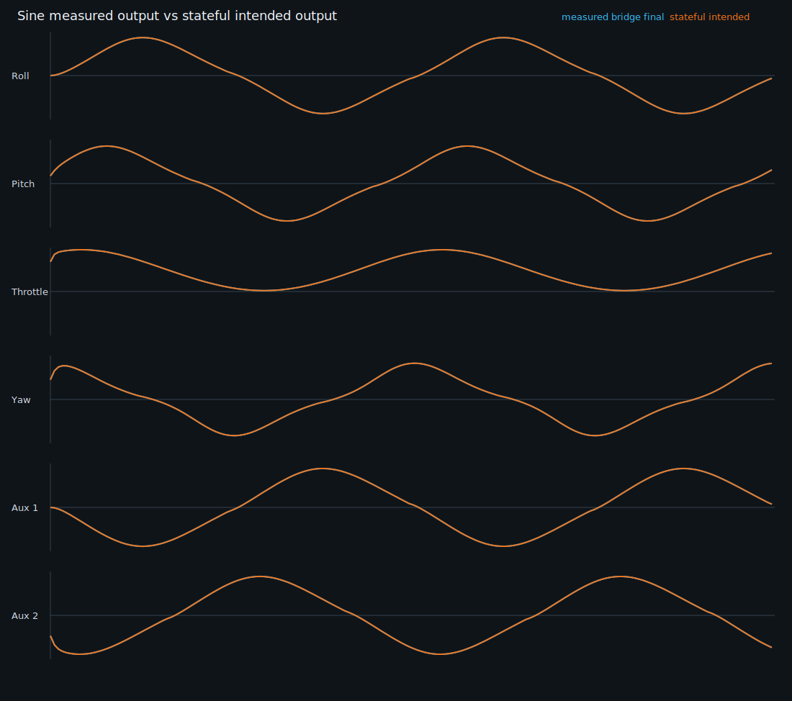
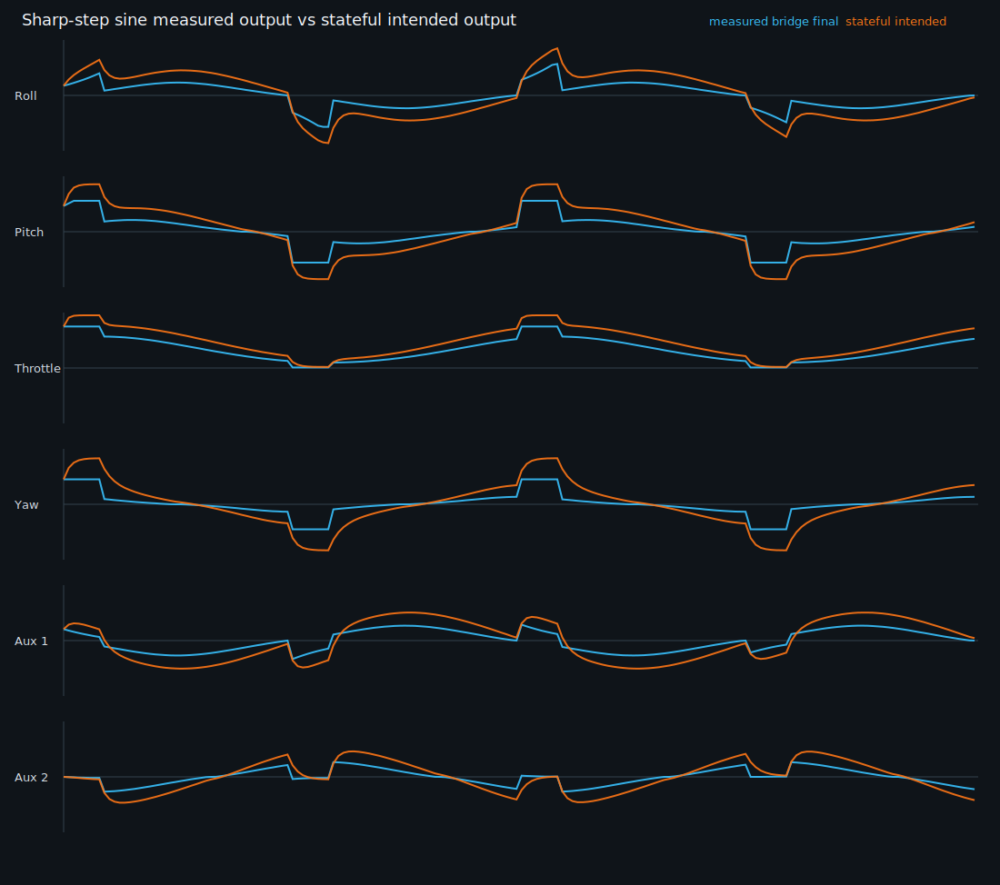
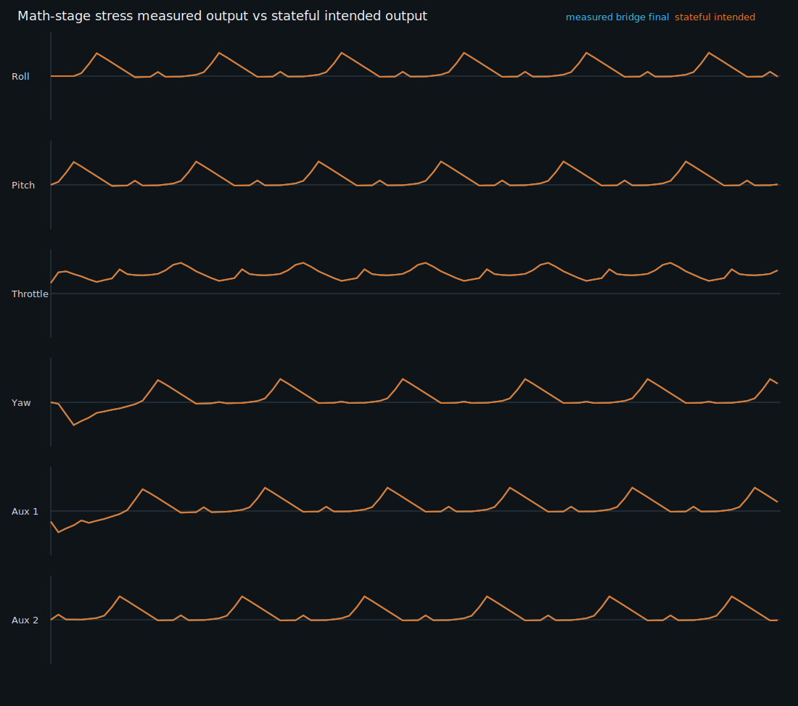

# Runtime Usability Fix 1A Control Chain Correctness Report

Generated: 2026-05-13

Scope: HOTAS input to stateful pipeline to workspace mapping to vJoy output intent/write payload correctness. This pass did not change UI rendering, Live Monitor behavior, Flight Recorder behavior, Help/Docs behavior, installer behavior, lifecycle gates, or output-verification claim semantics.

## Executive Result

Runtime Usability Fix 1A passes the deterministic no-hardware runtime proof and the optional simulated real-vJoy write-call proof on this machine.

The latest runtime truth probe artifact is:

- `artifacts/runtime-truth-value-usability/20260513T175804Z/summary.json`
- `docs/HelmForge/runtime-truth-value-usability-report.md`
- `docs/HelmForge/runtime-truth-value-usability-assets/axis-sine-measured-vs-intended.svg`
- `docs/HelmForge/runtime-truth-value-usability-assets/axis-sharp-step-measured-vs-intended.svg`
- `docs/HelmForge/runtime-truth-value-usability-assets/axis-math-stage-stress-measured-vs-intended.svg`

Latest probe result:

- Overall status: `passed`
- Failures: none
- HOTAS PID proof: deferred because the physical HOTAS was not detected during this run
- Real vJoy available: `true`
- Real vJoy device: `vJoy Device 1`
- Bridge status: `HelmForge Bridge: lifecycle=LiveVerified truth=blocked_missing_device output_verified=True`
- Important truth boundary: real vJoy proof is write-call proof only, not vJoy readback proof

## Root Causes Found

1. Per-sample runtime rebuilds were caused by bridge runtime I/O refresh recreating the `RuntimeOrchestrator` each tick. That discarded the math pipeline state on every sample, so filters, slew limiting, hysteresis, and previous-output logic never had a stable prior frame.

2. Bridge telemetry performed a second standalone math pipeline pass for rule summary/stage truth. That second pass was not the runtime output path, so telemetry could diverge from output intent and also obscured whether the runtime path itself was stateful.

3. Output intent was built from recovered/static routing instead of the active workspace mapping. The configured workspace mapping could be present and valid while the runtime output intent still used fallback routing.

4. Button input state was visible in input telemetry, but button states were not carried into output intent mapping and write payloads. The path was effectively axis-only for output intent.

5. Hysteresis telemetry existed as a parameter family but active hysteresis transitions were not reachable in the runtime stack because center conditioning did not receive previous runtime state.

## Files Changed

- `bridge_app/service.py`
- `shared_core/runtime/runtime_orchestrator.py`
- `shared_core/runtime/vjoy_output.py`
- `shared_core/math/filtering.py`
- `shared_core/math/stack.py`
- `v3_app/services/bridge_client.py`
- `scripts/runtime_truth_value_probe.py`
- `tests/test_runtime_usability_1a_control_chain_correctness.py`
- `tests/test_phase16b_runtime_frame_telemetry_ui.py`
- `tests/test_phase3_tuning_math_pipeline.py`
- `docs/HelmForge/runtime-truth-value-usability-report.md`
- `docs/HelmForge/runtime-truth-value-usability-assets/*.svg`

## Runtime State Continuity Fix

`BridgeService` now owns one `RuntimeOrchestrator` instance and updates its runtime context when material runtime context changes. A new input sample no longer recreates the orchestrator.

The orchestrator context signature is based on material configuration/state inputs:

- workspace mapping/tuning/rule config
- runtime config
- runtime truth/status
- physical input capability identity
- output backend identity
- output verification identity
- output loop identity
- explicit reset/reload events

It intentionally excludes per-sample input values, timestamps, and frame counters.

Stable simulated scenarios now keep `runtime_orchestrator_rebuild_count` at `1.0` for the full run:

| Scenario | Frames | Rebuild Count |
| --- | ---: | ---: |
| `axis_sine_fake` | 180 | 1.0 |
| `axis_sharp_step_sine_fake` | 180 | 1.0 |
| `buttons_toggle_fake` | 45 | 1.0 |
| `math_stage_stress_fake` | 96 | 1.0 |
| `mapping_variant_fake` | 2 | 1.0 |
| `axis_sine_real_vjoy` | 72 | 1.0 |
| `buttons_toggle_real_vjoy` | 45 | 1.0 |

Focused tests also verify that an intentional workspace config change triggers one controlled rebuild and that state resets predictably after that rebuild.

## Stateful Math Response

The runtime output now matches the stateful intended math pipeline response. Stage telemetry is generated from the already-computed `AxisStackResult`; there is no second pipeline pass for stage telemetry.

Measured max absolute differences from latest probe:

| Scenario | Max Final Diff | Max Mapped Output Diff |
| --- | ---: | ---: |
| `axis_sine_fake` | 0.000021 | 0.000021 |
| `axis_sharp_step_sine_fake` | 0.000026 | 0.000026 |
| `buttons_toggle_fake` | 0.000008 | 0.000008 |
| `math_stage_stress_fake` | 0.000010 | 0.000010 |
| `mapping_variant_fake` | 0.000010 | 0.000010 |
| `axis_sine_real_vjoy` | 0.000020 | 0.000020 |
| `buttons_toggle_real_vjoy` | 0.000008 | 0.000008 |

The tolerance remains strict and is not loosened to hide failures. The observed differences are rounding-level differences from serialized telemetry and probe comparison.

## Axis Mapping Proof

Output intent now uses active workspace mappings first. Static recovered routing remains fallback-only behavior for callers that do not provide a workspace mapping.

Default axis mapping verified:

| Logical Axis | Raw Input | Output Intent Target |
| --- | --- | --- |
| Roll | Axis 1 | X |
| Pitch | Axis 2 | Y |
| Throttle | Axis 3 | Z |
| Yaw | Axis 6 | RX |
| Aux 1 | Axis 7 | RY |
| Aux 2 | Axis 8 | RZ |

Temporary artifact-only mapping variant verified:

| Logical Axis | Variant Output Intent Target |
| --- | --- |
| Roll | Y |
| Pitch | X |
| Throttle | Z |
| Yaw | RX |
| Aux 1 | RY |
| Aux 2 | RZ |

The temporary mapping variant is created in the probe artifact workspace and does not mutate the repository workspace file. Probe output separates final logical pipeline values from mapped output intent values so a mapping swap is visible without pretending the math value changed.

## Button Mapping Proof

Button output intent now uses workspace button routes and is included in fake and real writer payloads.

Default mapping verified for B1 through B15:

| HOTAS Button | Default Output Button | Press Verified | Release Verified | No Unrelated Button True |
| --- | ---: | --- | --- | --- |
| B1 | Out1 | yes | yes | yes |
| B2 | Out2 | yes | yes | yes |
| B3 | Out3 | yes | yes | yes |
| B4 | Out4 | yes | yes | yes |
| B5 | Out5 | yes | yes | yes |
| B6 | Out6 | yes | yes | yes |
| B7 | Out7 | yes | yes | yes |
| B8 | Out8 | yes | yes | yes |
| B9 | Out9 | yes | yes | yes |
| B10 | Out10 | yes | yes | yes |
| B11 | Out11 | yes | yes | yes |
| B12 | Out12 | yes | yes | yes |
| B13 | Out13 | yes | yes | yes |
| B14 | Out14 | yes | yes | yes |
| B15 | Out15 | yes | yes | yes |

Temporary artifact-only mapping variant verified:

| HOTAS Button | Variant Output Button | Verified |
| --- | ---: | --- |
| B1 | Out2 | yes |
| B2 | Out1 | yes |

Latest probe button totals:

| Scenario | Expected True Outputs | Observed True Outputs |
| --- | ---: | ---: |
| `buttons_toggle_fake` | 15 | 15 |
| `math_stage_stress_fake` | 16 | 16 |
| `mapping_variant_fake` | 1 | 1 |
| `buttons_toggle_real_vjoy` | 15 | 15 |

Buttons do not remain latched after release unless a future mode explicitly implements latching.

## Output Intent To vJoy Writer Payload

`build_workspace_virtual_output_intent` now creates output intent from the active workspace mapping:

- logical final axis values are mapped to vJoy axis labels
- `X`, `Y`, `Z`, `RX`, `RY`, and `RZ` are always present in output intent
- button routes map HOTAS `B#` input state to output `Out#` booleans
- fake writer records and real writer call records consume the same output intent source of truth

Latest real-vJoy write-call proof:

| Scenario | Backend | Writes | Successful Writes |
| --- | --- | ---: | ---: |
| `axis_sine_real_vjoy` | real_vjoy | 73 | 73 |
| `buttons_toggle_real_vjoy` | real_vjoy | 46 | 46 |

No vJoy readback channel exists in this pass. Therefore accepted write calls are reported only as accepted write-call proof, not true vJoy device readback proof.

## Math Stage Stress Coverage

The stress waveform was expanded so each named math parameter family is covered by measured stage telemetry.

| Stage / Parameter Family | Covered | Evidence |
| --- | --- | --- |
| Curve Mode | yes | `Curve / Shape` exposes `curve_mode` |
| Curve Strength | yes | stress workspace sets `curve_strength=0.64` |
| Deadzone | yes | `Center Conditioning` exposes `deadzone=0.12` |
| Anti-Deadzone | yes | `Center Conditioning` exposes `anti_deadzone=0.18` |
| Hysteresis | yes | stress workspace sets `hysteresis=0.04` and active transition coverage is required |
| Output Scale | yes | `Base Output Limits` exposes `configured_output_scale=1.35` |
| Max Output | yes | `Base Output Limits` exposes `max_output=0.72` and clamping is driven |
| Center Alpha | yes | `Filtering` exposes `center_alpha=0.18` on center-region samples |
| Edge Alpha | yes | `Filtering` exposes `edge_alpha=0.82` on edge-region samples |
| Same Slew Limit | yes | `Filtering` exposes `same_slew_limit=0.24` and same-direction limiting |
| Reverse Slew Limit | yes | `Filtering` exposes `reverse_slew_limit=0.11` and reverse-direction limiting |
| Conditional Rules | yes | stress workspace enables a Yaw output-scale rule gated by Roll final output |

The hysteresis repair was intentionally small: center conditioning now receives prior runtime filter state so `hysteresis_active` can be truthfully produced by the existing stage data.

## Graphs

Measured output response compared to intended output response:







## Verification Commands Run

Passed:

```powershell
python -m pytest tests/test_runtime_usability_1a_control_chain_correctness.py -q
python -m pytest tests/test_phase16b_runtime_frame_telemetry_ui.py -q
python -m pytest tests/test_phase3_tuning_math_pipeline.py -q
python scripts/runtime_truth_value_probe.py
python scripts/runtime_truth_value_probe.py --real-vjoy-writes
python -m py_compile scripts/runtime_truth_value_probe.py v3_app/services/bridge_client.py shared_core/runtime/runtime_orchestrator.py shared_core/math/filtering.py
python -m bridge_app.main --status
powershell -NoProfile -ExecutionPolicy Bypass -File .\scripts\runtime_setup_check.ps1 -DryRun
git diff --check
```

Full pytest was also run:

```powershell
python -m pytest
```

Result: `875 passed, 1 failed`.

The failure was `tests/test_lcd_7v_critical_page_stability_and_math.py::test_lcd_7v_live_monitor_idle_and_identical_frames_do_not_rebuild_or_duplicate_history`, which observed Live Monitor graph `historyLength=2` where the test expected `<=1`. That area is explicitly outside Runtime Usability Fix 1A scope, and no Live Monitor rendering/performance files were changed in this pass. The exact test passed when run in isolation, but failed when run as part of its file and full suite. This is documented rather than hidden.

## No-Hardware Runtime Correctness Proof

The no-hardware proof passed using deterministic simulated/fake input:

- simulated axis sine input
- simulated sharp-step sine input
- simulated math-stage stress input
- simulated B1-B15 button toggles
- simulated temporary mapping variant
- fake writer payload verification
- output intent verification
- runtime rebuild-count verification
- no-second-pipeline-pass stage telemetry verification

The physical HOTAS may have been unplugged, and this run did not block on that.

## Optional Real vJoy Write-Call Proof

Real vJoy was available and accepted simulated output writes:

- `axis_sine_real_vjoy`: 73 successful writes
- `buttons_toggle_real_vjoy`: 46 successful writes

This is not readback verification. No claim is made that vJoy device state was read back from the driver.

## Deferred Physical HOTAS Proof

Deferred until the physical HOTAS is plugged in:

- current physical HOTAS VID/PID proof
- real physical HID input sampling proof
- physical HOTAS input to vJoy write-call proof

The latest bridge truth correctly reports `blocked_missing_device` while preserving the output/write-call proof boundary.

## Runtime Truth Preservation Statement

This pass preserves the existing runtime truth boundaries:

- `output_verified=True` remains a bridge/backend write capability truth, not a vJoy readback claim.
- Missing physical HOTAS remains a blocked live-device condition, not a hidden pass.
- Simulated no-hardware correctness is separated from optional real-vJoy write calls.
- Full Live Runtime Ready truth rules were not loosened.
- Stage telemetry is reported from the runtime pipeline result and does not add a second pipeline pass.

